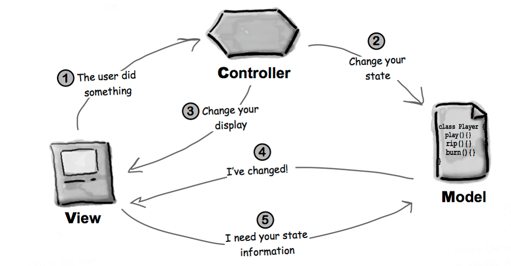
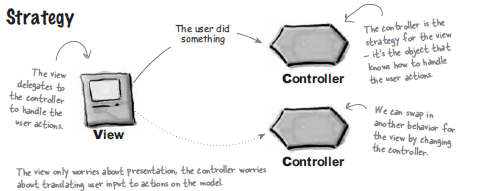
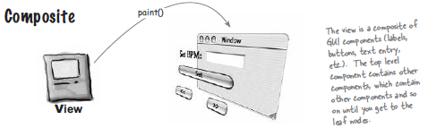
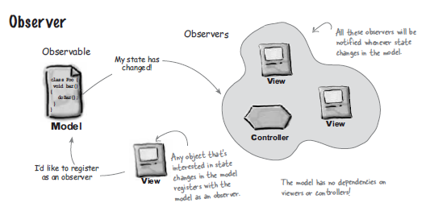

```{r setup, include=FALSE}
options(htmltools.dir.version = FALSE)
knitr::opts_chunk$set(collapse = TRUE,
                      fig.retina = 3)

# devtools::install_github("hadley/emo")
# devtools::install_github("rstudio/fontawesome")
library(emo)
library(fontawesome) # from github: https://github.com/rstudio/fontawesome

```

```{r, load_refs, include=FALSE, cache=FALSE}
source("load_references.r")
```

name: title
class: left, top

.left-column[

# .fancy[`r rmarkdown::metadata$title`]

### &#183; `r rmarkdown::metadata$subtitle`

`r rmarkdown::metadata$author`&#183; `r rmarkdown::metadata$institute`

`r rmarkdown::metadata$description` &#183; `r rmarkdown::metadata$date`

]

.right-column[

```{r, fig.cap="MVC from hackernoon.com", out.width = '100%', echo=FALSE}
knitr::include_graphics('https://hackernoon.com/_next/image?url=https%3A%2F%2Fcdn.hackernoon.com%2Fhn-images%2F0*7LesGFlzQzpGiP8m&w=3840&q=75')
```
]

???
Image credits: [hackernoon.com](https://hackernoon.com/from-mvc-to-modern-web-frameworks-8067ec9dee65)


---
class: inverse, center, middle

.acid[Model-View-Controller (MVC)]

--

.heat[Model-View-Presenter (MVP)]

--

.cold[Model-View-ViewModel (MVVM)]


---
# .acidinline[MVC] Inicios

.left-column[

```{r, fig.cap="Trygve Reenskaug from Wikipedia", out.width = '100%', echo=FALSE}
knitr::include_graphics('https://upload.wikimedia.org/wikipedia/commons/7/77/Trygve_Reenskaug_%282010%29.jpg')
```

]

.right-column[

.large[`r fontawesome::fa(name = "arrow-circle-right")`  [Formulada](http://heim.ifi.uio.no/~trygver/themes/mvc/mvc-index.html) en 1978/79]

.large[`r fontawesome::fa(name = "arrow-circle-right")` Como un lenguaje compartido para describir problemas y sus soluciones ("Pattern Language")]

.large[`r fontawesome::fa(name = "arrow-circle-right")` Uso predominante en la era pre-Web para GUI (Smalltalk, Mac OS, Windows...) ]
]


---
# .acidinline[MVC] Componentes 

## .acidinline[M]odel `r fontawesome::fa(name = "arrow-circle-right")` datos y su lógica

## .acidinline[V]iew `r fontawesome::fa(name = "arrow-circle-right")` presentación de datos e interacción del usuario

## .acidinline[C]ontroller `r fontawesome::fa(name = "arrow-circle-right")` El pegamiento (interfaz) entre `Model` y `View`


---
# .acidinline[MVC] Componentes 

```{r, fig.cap="MVC from Head First Design Patterns", out.width = '90%', echo=FALSE}

```

---
# .acidinline[MVC] ¿Patrón de diseño o de arquitectura?

--

.pull-left[

## .center[MVC como patrón de diseño .acidinline[si soluciona problemas específicos]]
]

--

.pull-right[

## .center[MVC como patrón de arquitectura .acidinline[si afecta a toda (la arquitectura de) la aplicación]]

]

???

¿Qué gorra nos ponemos? ¿La de arquitecto, como al principio del curso? ¿o la de diseñador/programador, como en la parte de patrones de diseño?. MVC admite una, la otra, o ambas a la vez. 

---
# .acidinline[MVC] Como patrón (.acidinline[compuesto]) de diseño 


```{r, fig.cap="MVC from Head First Design Patterns", out.width = '90%', echo=FALSE}

```


---
# .acidinline[MVC] Como patrón (compuesto) de diseño 

### .acidinline[V]iew-.acidinline[C]ontroller `r fontawesome::fa(name = "arrow-circle-right")` [`Strategy`](https://cgranell.github.io/ei1039/slides/TE7_2_strategy.html#title)

-   .large[`View` es un objeto configurado con una estrategia; el `Controller` proporciona la estrategia] 

-   .large[`View` se encarga solo del aspecto visual y delega el resto al `Controller`, que se encarga de interactuar con el `Model`] 

-   .large[`View` está desacoplado, no conoce nada de la interacción entre el `Controller` y `Model`] 


---
# .acidinline[MVC] Como patrón (compuesto) de diseño 

```{r, fig.cap="MVC-Strategy from Head First Design Patterns", out.width = '90%', echo=FALSE}

```

---
# .acidinline[MVC] Como patrón (compuesto) de diseño 

### .acidinline[V]iew `r fontawesome::fa(name = "arrow-circle-right")` [`Composite`](https://cgranell.github.io/ei1039/slides/TE5_1_composite.html#title)

-   .large[`View` consiste en un conjunto de ventanas, paneles, botones, etiquetas, etc.]

-   .large[Cada elemento visual es o bien un _Composite_ (un frame) o bien un _Leaf_ (un botón)]
] 


---
# .acidinline[MVC] Como patrón (compuesto) de diseño 

```{r, fig.cap="MVC-Composite from Head First Design Patterns", out.width = '90%', echo=FALSE}

```


---
# .acidinline[MVC] Como patrón (compuesto) de diseño 

### .acidinline[V]iew-.acidinline[M]odel `r fontawesome::fa(name = "arrow-circle-right")` [`Observer`](https://cgranell.github.io/ei1039/slides/TE6_1_observer.html#title)

-   .large[`Model` implementa el patrón `Observer`]

-   .large[`View` (y `Controller`) es un observador del `Model`]

-   .large[`Model` está completamente desacoplado: no depende de la `View` ni del `Controller`]

-   .large[Permite cambiar la `View` sin afectar al `Model`]


---
# .acidinline[MVC] Como patrón (compuesto) de diseño 

```{r, fig.cap="MVC-Observer from Head First Design Patterns", out.width = '90%', echo=FALSE}

```

---
# .acidinline[MVC] proporciona 

.large[`r fontawesome::fa(name = "arrow-circle-right")` _separation of concerns_]

.large[`r fontawesome::fa(name = "arrow-circle-right")` componentes _reutizables_]

.large[`r fontawesome::fa(name = "arrow-circle-right")` componentes que pueden _desplegarse_ independientemente]

.large[`r fontawesome::fa(name = "arrow-circle-right")` componentes que pueden _testearse_ independientemente]

---
# .acidinline[MVC] Como patrón de arquitectura

<br/><br/><br/><br/>

.center[.large[Además de afectar a toda la aplicación, MVC entra en un escenario más complejo con la introducción de la Web (__Web MVC__) y los frameworks modernos (__Web & mobile frameworks__)]]

???
¿Cambiamos de gorra o nos ponemos las dos a la vez?

Web framework = a software platform for developing web applications and websites.

---
background-image: url(https://hackernoon.com/hn-images/0*1VVNmPlwpfeytDMh)
background-size: contain
# Web MVC

```{r, fig.cap="Web MVC from hackernoon.com", out.width = '80%', echo=FALSE, eval=FALSE}
knitr::include_graphics('https://hackernoon.com/hn-images/0*1VVNmPlwpfeytDMh')
```

???
Image credits: [hackernoon.com](https://hackernoon.com/from-mvc-to-modern-web-frameworks-8067ec9dee65)

---
# Web MVC

.pull-left[

```{r, fig.cap="Web MVC from hackernoon.com", out.width = '100%', echo=FALSE}
knitr::include_graphics('https://hackernoon.com/hn-images/0*1VVNmPlwpfeytDMh')
```


]

.pull-right[

.large[`r fontawesome::fa(name = "arrow-circle-right")` `Controller` gestiona la petición inicial, no la `View`]

.large[`r fontawesome::fa(name = "arrow-circle-right")` La `View` "amasa" HTML, JS y CSS (_templating_) para el _browser_ en vez de presentar datos y manejar entradas de datos]

.large[`r fontawesome::fa(name = "arrow-circle-right")` HTML/JS tiene lógica (_button click handlers_) que lanza acciones al `Controller` via peticiones HTTP]
]

???
https://hackernoon.com/from-mvc-to-modern-web-frameworks-8067ec9dee65

---
background-image: url(https://hackernoon.com/hn-images/0*dTPUy_vSyQPHe-kX)
background-size: contain
# Web Frameworks

```{r, fig.cap="Modern Web Frameworks from hackernoon.com", out.width = '65%', echo=FALSE, eval=FALSE}
knitr::include_graphics('https://hackernoon.com/hn-images/0*dTPUy_vSyQPHe-kX')
```

???
Image credits: [hackernoon.com](https://hackernoon.com/from-mvc-to-modern-web-frameworks-8067ec9dee65)


---
# Web Frameworks


.pull-left[

```{r, fig.cap="Modern Web Frameworks from hackernoon.com", out.width = '100%', echo=FALSE}
knitr::include_graphics('https://hackernoon.com/hn-images/0*dTPUy_vSyQPHe-kX')
```

]

.pull-right[

.large[`r fontawesome::fa(name = "arrow-circle-right")` [Single-Page Applications (SPA)](https://en.wikipedia.org/wiki/Single-page_application) precarga recursos una sola vez  para UX más fluida]

.large[`r fontawesome::fa(name = "arrow-circle-right")` Nuevas SPA (_static bundles_) se sirven con baja latencia]


.large[`r fontawesome::fa(name = "arrow-circle-right")` SPA realiza peticiones HTTP para obtener recursos via `API Controller`]


]

???
https://hackernoon.com/from-mvc-to-modern-web-frameworks-8067ec9dee65


---
class: inverse, center, middle

.heat[Model-View-Presenter (MVP)]

---
# .heatinline[MVP] Model-View-.heatinline[Presenter]


```{r, fig.cap="MVC-MVP from medium.com", out.width = '100%', echo=FALSE}
knitr::include_graphics('https://miro.medium.com/max/1400/0*CNMHroWFQUOEC-PI.png')
```

???
https://medium.com/@tinmegali/model-view-presenter-mvp-in-android-part-1-441bfd7998fe


---
# .heatinline[MVP] Model-View-.heatinline[Presenter]

.pull-left[

```{r, fig.cap="MVP-Android from medium.com", out.width = '100%', echo=FALSE}
knitr::include_graphics('https://miro.medium.com/max/1400/0*nryKBiuwZthT--SA.png')
```

]

.pull-right[

.large[`r fontawesome::fa(name = "arrow-circle-right")` `Model` y `View` igual; `Presenter` es el nuevo `Controller`]

.large[`r fontawesome::fa(name = "arrow-circle-right")` `Presenter` actúa de mediador entre `View` y `Model`]

.large[`r fontawesome::fa(name = "arrow-circle-right")` 1:1 mapping entre `Presenter` y `View`]

.large[`r fontawesome::fa(name = "arrow-circle-right")` Mayor separación entre `View` y `Model` facilita Unit tests]


]

???
https://medium.com/@tinmegali/model-view-presenter-mvp-in-android-part-1-441bfd7998fe

---
class: inverse, center, middle

.cold[Model-View-ViewModel (MVVM)]


---
# .coldinline[MVVM] Model-View-.coldinline[ViewModel]

```{r, fig.cap="MVVM from Wikipedia", out.width = '100%', echo=FALSE}
knitr::include_graphics('https://upload.wikimedia.org/wikipedia/commons/8/87/MVVMPattern.png')
```


---
# .coldinline[MVVM] Model-View-.coldinline[ViewModel]


.pull-left[

```{r, fig.cap="MVVM from MSDN", out.width = '100%', echo=FALSE}
knitr::include_graphics('https://docs.microsoft.com/en-us/previous-versions/msp-n-p/images/hh830877.1afe20bab0052f5ab0fc400bf3b6f3f7(en-us,pandp.10).png')
```

]

.pull-right[

.large[`r fontawesome::fa(name = "arrow-circle-right")` `ViewModel` es el nuevo `Presenter`]

.large[`r fontawesome::fa(name = "arrow-circle-right")` `ViewModel` ofrece el modelo exacto que le gusta al `View`]

.large[`r fontawesome::fa(name = "arrow-circle-right")` `ViewModel` tiene un _binder_ para sincronizacion automática entre propiedades enlazadas (_bounded_) del `View` con `ViewModel`]

.large[`r fontawesome::fa(name = "arrow-circle-right")` `ViewModel` se mantiene sincronizado con `Model`]
]

???
https://docs.microsoft.com/en-us/previous-versions/msp-n-p/hh848246(v=pandp.10)?redirectedfrom=MSDN

---
# Modern Web (& mobile) frameworks

### .acidinline[(Push-based) MVC] `r fontawesome::fa(name = "arrow-circle-right")` [Spring MVC](https://vuejs.org/), [Ruby on Rails](http://rubyonrails.org/), [Django](https://www.djangoproject.com/)...


### .heatinline[MVP] `r fontawesome::fa(name = "arrow-circle-right")` [Lavarel](https://laravel.com/), ...


### .coldinline[MVVM] `r fontawesome::fa(name = "arrow-circle-right")` [VueJS](https://vuejs.org/), KnockoutJS, [EmberJS](https://emberjs.com/), [Angular](https://angular.io/)...


---
class:center, middle

# Ten en cuenta que 

--

.large[Los frameworks modernos ya no se ajustan fielmente a las tres capas clásicas (M,V,C), ni resulta fácil clasificarlos dentro de las variantes MVC] 

--

.large[Surgen más capas ([Middleware](https://laravel.com/docs/8.x/middleware), [Requests](https://laravel.com/docs/8.x/requests),...) por complejidad y necesidades crecientes] 

--

### Organiza y estructura tus apps de forma que soluciones tus problemas


???

MVC frameworks observe a push-based architecture, also known as ‘action-based.’ They adopt actions that do the necessary processing and then accordingly ‘push’ the data to a view layer to furnish the outcome.  Some examples of frameworks are 

https://hackernoon.com/from-mvc-to-modern-web-frameworks-8067ec9dee65

https://www.monocubed.com/10-most-popular-web-frameworks/


---
# Recursos

-   .large[[Wikipedia: Model–view–viewmodel](https://en.wikipedia.org/wiki/Model%E2%80%93view%E2%80%93viewmodel)]

-   .large[[Wikipedia: Model–view–presenter](https://en.wikipedia.org/wiki/Model%E2%80%93view%E2%80%93presenter)]

-   .large[[From MVC to Modern Web Frameworks](https://hackernoon.com/from-mvc-to-modern-web-frameworks-8067ec9dee65)]

-   .large[[The MVC, MVP, and MVVM Smackdown](https://academy.realm.io/posts/eric-maxwell-mvc-mvp-and-mvvm-on-android/)]

-   .large[Model View Presenter (MVP) in Android, [Part 1](https://medium.com/@tinmegali/model-view-presenter-mvp-in-android-part-1-441bfd7998fe), [Part 2](https://medium.com/@tinmegali?p=a15e35891095), [Part 3](https://medium.com/@tinmegali/model-view-presenter-mvp-no-android-parte-3-f0b0a6966579)]

-   .large[[MVP for Android: how to organize the presentation layer](http://antonioleiva.com/mvp-android/)]

-   .large[[10 Popular Web Frameworks for Web App Development in 2021](https://www.monocubed.com/10-most-popular-web-frameworks/)]


