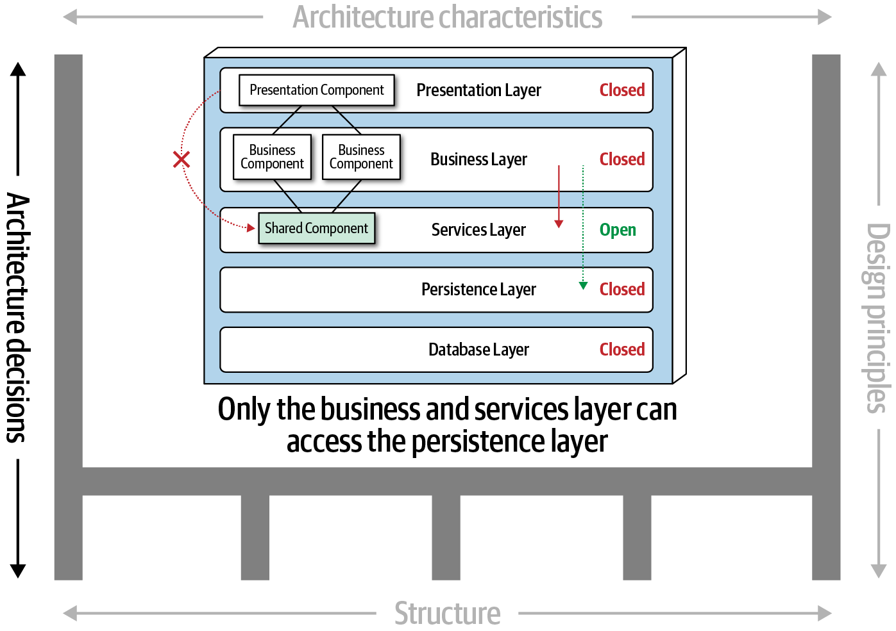

```{r setup, include=FALSE}
options(htmltools.dir.version = FALSE)
knitr::opts_chunk$set(collapse = TRUE,
                      fig.retina = 3)
```

```{r, load_refs, include=FALSE, cache=FALSE}
source("load_references.r")
```

name: title
class: right, top
background-image: url(images/rawpixel/europeancity.jpg)
background-size: cover


# .fancy[`r rmarkdown::metadata$title`]

# .fancy[&#183; `r rmarkdown::metadata$subtitle`]

<br/><br/><br/><br/><br/><br/><br/><br/><br/><br/><br/><br/>


.whiteinline[`r rmarkdown::metadata$author`&#183; `r rmarkdown::metadata$institute`]

.whiteinline[`r rmarkdown::metadata$description` &#183; `r rmarkdown::metadata$date`]


???

A European city. Original public domain image from Wikimedia Commons.
Image credits: [Rawpixel.com](https://www.rawpixel.com/image/3285415/free-photo-image-city-architecture-apartment-building)


---
class: inverse, center, middle

# ¿Qué es una arquitectura de software?

---
class: center, top


### ¿Una aplicación móvil?

--

### ¿Una librería software?

--

### ¿Una aplicación empresarial?

--

### ¿Una red de sensores desplegados en la ciudad junto a un centro (hub) de datos?

--

### ¿Un diagrama de classes?

---
# .center[Arquitectura de software `r Cite(my_refs, "fowler2003")`]

>  .large[Architecture is about the important stuff. Whatever that is.]

<br/>

>  .large[Architecture is a social construct, a shared understanding of the system. It doesn't depend on the software, but on what part of the software is considered important by group consensus.] 

.right[Ralph Johnson]

---
class: center, middle

### .fat[Arquitectura de software es algo difícil de definir, depende del escenario/proyecto, y de lo que se considera importante para el éxito del proyecto]


---
class: center
# Definición arquitectura `r Cite(my_refs, "richards2020")`


???

Image credits: `r Cite(my_refs, "richards2020")`

---
class: inverse, center, middle

# Estructura 

## tipo de estilo(s) de arquitectura, como por capas, microservicios, etc.

---
class: center
# Definición arquitectura


???

Image credits: `r Cite(my_refs, "richards2020")`


---
class: inverse, center, middle

# Características de la arquitectura 

## criterios/requisitos para el funcionamiento correcto del sistema (ortogonal a la funcionalidad)


---
class: center
# Definición arquitectura


???

Image credits: `r Cite(my_refs, "richards2020")`

---
class: inverse, center, middle

# Decisiones de la arquitectura 

## reglas/restricciones del sistema, i.e., que se puede y no se puede hacer


---
class: center
# Definición arquitectura



???

Image credits: `r Cite(my_refs, "richards2020")`

---
class: inverse, center, middle

# Principios de diseño 

## guías, recomendaciones o preferencias (en vez de _reglas tajantes_ como las decisiones)

---
class: center
# Definición arquitectura


???

Image credits: `r Cite(my_refs, "richards2020")`


---
background-image: url(images/rawpixel/architect.jpg)
background-size: cover

???

Home Decor Renovation Style Architecture Building
Image by [rawpixel.com](https://www.rawpixel.com/image/65068/)


---
class: inverse, center, middle

# ¿Qué tareas lleva a cabo un/a arquitecto/a de software?


---
class: center
# Arquitecto vs. diseñador/desarrollador


???

A developer’s early career focuses on expanding the top of the pyramid, to build experience and expertise.
Image credits: `r Cite(my_refs, "richards2020")`


---
class: center
# Arquitecto vs. diseñador/desarrollador


???

What someone knows is technical depth, and how much someone knows is technical breadth
Image credits: `r Cite(my_refs, "richards2020")`

---
class: center
# Arquitecto vs. diseñador/desarrollador

.pull-left[
## Arquitecto   

.acid[breadth] >> .coldinline[depth]

]

.pull-right[
## Diseñador  

.cold[depth] >> .acidinline[breadth]

]

---
class: center
# Arquitecto = .acidinline[breadth] >> .coldinline[depth]


???


Image credits: `r Cite(my_refs, "richards2020")`

---
class: center

# ¿Qué tareas lleva a cabo un/a arquitecto/a?

### Realizar decisiones de arquitectura y principios de diseño (guía)

--

### Analizar continuamente la arquitectura y recomendar mejoras

--

### Estar al día con (y expuesto a) las últimas tendencias

--

### Asegurarse que la implementación sigue las decisiones/principios

--

### Poseer conocimiento de negocio

--

### Poseer habilidades de comunicación, liderazgo, soft skills!

---
# .center[Resumen]


> .large[Everything in software architecture is a trade-off.]

.right[First Law of Software Architecture]

<br/>

> .large[Why is more important than how.]

.right[Second Law of Software Architecture]


---
# Referencias

```{r print_refs1, echo=FALSE, results="asis"}
PrintBibliography(my_refs, start = 1, end = 2)
```
