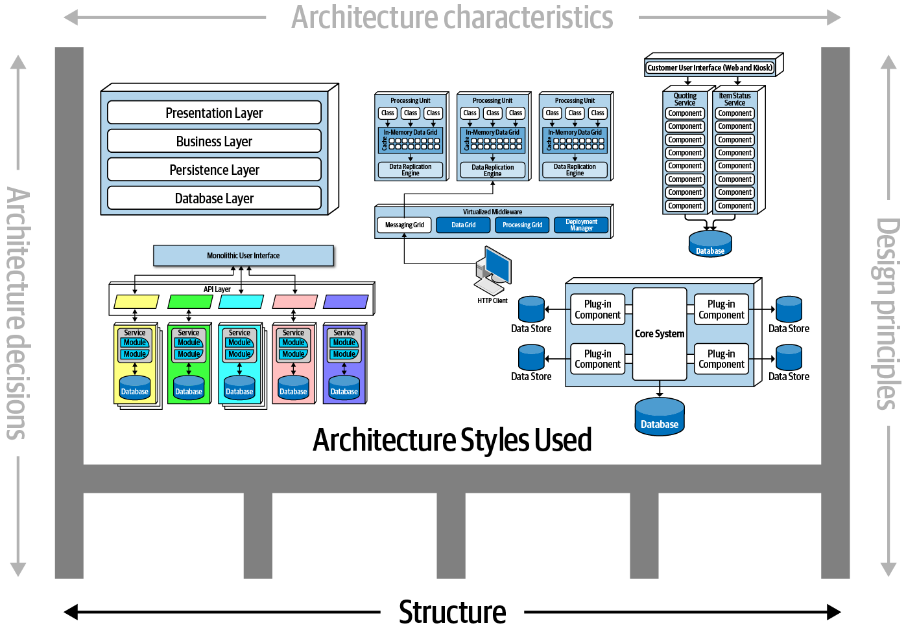

```{r setup, include=FALSE}
options(htmltools.dir.version = FALSE)
knitr::opts_chunk$set(collapse = TRUE,
                      fig.retina = 3)
```

```{r, load_refs, include=FALSE, cache=FALSE}
source("load_references.r")
```

name: title
class: right, top
background-image: url(images/rawpixel/europeancity.jpg)
background-size: cover


# .fancy[`r rmarkdown::metadata$title`]

### `r rmarkdown::metadata$subtitle`

__`r rmarkdown::metadata$description` &#183; `r rmarkdown::metadata$date`__

__`r rmarkdown::metadata$author`&#183; `r rmarkdown::metadata$institute`__


???

A European city. Original public domain image from Wikimedia Commons.
Image credits: [Rawpixel.com](https://www.rawpixel.com/image/3285415/free-photo-image-city-architecture-apartment-building)


---
class: inverse, center, middle

# ¿Qué es una arquitectura de software?

---
class: center, top


### Una aplicación móvil

--

### una librería 

--

###

---
class: center
# Arquitectura de software

## Algo dificil de definir, depened del escenario/proyecto contcreto

---
class: center
# Definición arquitectura `r Cite(my_refs, "richards2020")`


???

Image credits: `r Cite(my_refs, "richards2020")`

---
class: inverse, center, middle

# Estructura 

## tipo de estilo(s) de arquitectura, como por capas, microservicios, etc.

---
class: center
# Definición arquitectura



???

Image credits: `r Cite(my_refs, "richards2020")`


---
class: inverse, center, middle

# Características de la arquitectura 

## criterios/requisitos par ael funcionamiento correcto del sistema (ortogonal a la funcionalidad)


---
class: center
# Definición arquitectura


???

Image credits: `r Cite(my_refs, "richards2020")`

---
class: inverse, center, middle

# Decisiones de la arquitectura 

## reglas/restricciones para la construcion del sistema, i.e., que se puede y no se puede hacer


---
class: center
# Definición arquitectura


???

Image credits: `r Cite(my_refs, "richards2020")`

---
class: inverse, center, middle

# Principios de diseño 

## guías preferencias (en vez de _reglas tajantes_ como las decisiones)

---
class: center
# Definición arquitectura


???

Image credits: `r Cite(my_refs, "richards2020")`

---
# Dimensiones

## Estructura (estilo) 
## Caracteristicas de la arquitectura
## Decisiones de arquitectura
## Principios de diseño


---
background-image: url(images/rawpixel/architect.jpg)
background-size: cover

???

Home Decor Renovation Style Architecture Building
Image by [rawpixel.com](https://www.rawpixel.com/image/65068/)

---
# Referencias

```{r print_refs1, echo=FALSE, results="asis"}
PrintBibliography(my_refs, start = 1, end = 1)
```
