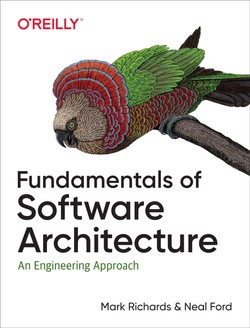
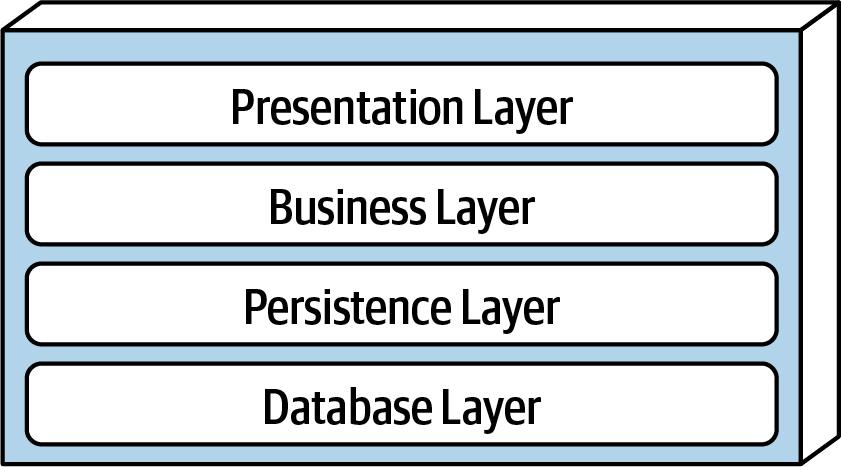
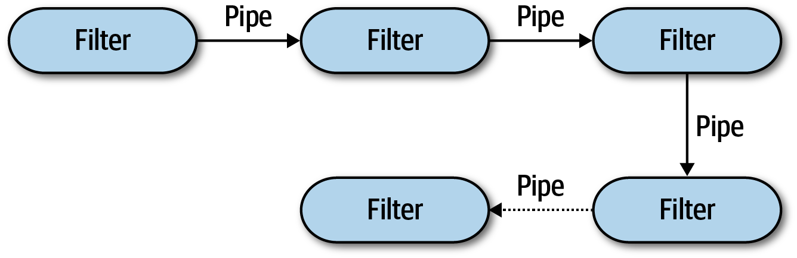

```{r setup, include=FALSE}
options(htmltools.dir.version = FALSE)
knitr::opts_chunk$set(collapse = TRUE,
                      fig.retina = 3)
```

```{r, load_refs, include=FALSE, cache=FALSE}
source("load_references.r")
```

name: title
class: left, top
background-image: url(images/rawpixel/florence-cathedral.jpg)
background-size: cover

# .fancy[`r rmarkdown::metadata$title`]

### &#183; `r rmarkdown::metadata$subtitle`

<br/><br/><br/><br/><br/><br/><br/><br/><br/><br/><br/><br/><br/>


.right[`r rmarkdown::metadata$author`&#183; `r rmarkdown::metadata$institute`]

.right[`r rmarkdown::metadata$description` &#183; `r rmarkdown::metadata$date`]


???

Florence cathrdral. Gothic style. Original public domain image from Wikimedia Commons.
Image credits: [Rawpixel.com](https://www.rawpixel.com/image/3286364)


---
class: center
# Recuerda: Dimensiones arquitectura


???

Image credits: `r cite("richards2020")`


---

.pull-left[




]

.pull-right[

### By Mark Richards, Neal Ford

### Released January 2020

.large[Capítulos 9 - 18 `r cite("richards2020")`]

]

---
class: inverse, center, middle

# ¿Estructura o estilo de arquitectura?

--

## .acidinline[como se estructura o organiza todo el backend e interfaces de usuario.]

--

.large[Spoiler: Seminario conjunto de Arquitectura Software]


---
class: center
# Categorías de estilos de arquitectura

.pull-left[

## .fatinline[Monolíticos]

### Por capas
### Pipeline
### Microkernel

]

--

.pull-right[

## .acidinline[Distribuídos]

### Event-driven
### Service-oriented
### Microservicios

]

???

Monolítico: una única unidad de código
Distribuídos: varias unidades/nodos conectadas con protocolos de acceso remoto

---
# .center[.fatinline[Estilos monolíticos]]

.left-column[
### Por capas (_n-tiers_)

]

.right-column[



]

???

Image credits: `r cite("richards2020")`


---
# .center[.fatinline[Estilos monolíticos]]

.left-column[
### Por capas

]

.right-column[


- .large[Separation of concerns] 
- .large[Layers of isolation]
- .large[Partición de capas por criterios tecnológicos]

]

???

Separation of concerns: Componentes en una capas solo saben de la lógica de esa capa

Layers of isolation: Modificaciones en una capa no afectan a otras; capas independientes/desacopladas

Partición por criterios tecnólogicos: Componentes, en lugar de agruparse por dominio (como clientes), se agrupan por su función técnica en la arquitectura (presentación, negocio)


---
# .center[.fatinline[Estilos monolíticos]]

.left-column[
### Por capas
### Pipeline (|)

]

.right-column[



]

???

Pipes & filters transforman documentos/datos/mensajes de forma concatenada

Image credits: `r cite("richards2020")`


---
# .center[.fatinline[Estilos monolíticos]]

.left-column[
### Por capas
### Pipeline (|)

]

.right-column[


> Según `r cite("rodriguez2021")`, con respecto a la gestión de datos de entrada en streaming, el primer componente en el paso __5__ es un sistema de mensajería basado en [Apache Kafka](https://kafka.apache.org/), que asegura la __recepción, buffer y ruteo__ del flujo de datos en streaming. 

- .large[herramientas ETL (_extract, transform, and load_)] 
- .large[cadenas de productor-consumidor de datos]
- .large[datos en streaming (telemetria, sensores, etc)]

]

???

"The first component is the (Kafka) messaging system, which ensures reliable
handling (receive, buffer, route) of the incoming flow of data. The message system
emits and exchanges messages, which contain the metrics data payload,
through a Kafka topic to which connector applications can subscribe in order
to handle/process the data stream. One such connector application is the self-developed
persistence component, which connects to the (Kafka) messaging system
and persists the messages in the (Cassandra) database" (pg 89)

Image credits: `r cite("rodriguez2021")`


---
# .center[.fatinline[Estilos monolíticos]]

.left-column[
### Por capas
### Pipeline
### Microkernel

]

.right-column[


]

???

_Core system_ es la funcional mínima/básica del sistema.

_Plug-ins_ son componentes independientes, _standalone_ que proporcionan funcionalidad adicional.

Image credits: `r cite("richards2020")`

---
# .center[.fatinline[Estilos monolíticos]]

.left-column[
### Por capas
### Pipeline
### Microkernel

]

.right-column[


]

???

Core system es la minima funcionlidad required para el sistema básico.

Plug-ins son componentes independientes que añaden funcionalidad adicional al core sytemm

Image credits: `r cite("richards2020")`

---
# .center[.fatinline[Estilos monolíticos]]

.left-column[
### Por capas
### Pipeline
### Microkernel

]

.right-column[

- .large[_Core system_ es extensible]

- .large[_Plug-ins_ independientes, encapsulados y autónomos (_standalone_), que se comunican con el sistema (REST, pipe, ...)]

- .large[__VSCode__ _extensions_, __Jira__ _plugins_, __Chrome__ _extensions_, __Firefox__ _add-ons_, __Alexa__ _skills_, etc. ]

]


---
# .center[.acidinline[Estilos distribuídos]]

.left-column[
### Event-driven

]

.right-column[


]

???

Productor emite un evento/tópico. Consumir se suscribe a eventos/tópicos. 

Cola de eventos facilita mensajes asincronos.


Image credits: `r cite("richards2020")`

---
# .center[.acidinline[Estilos distribuídos]]

.left-column[
### Event-driven

]

.right-column[

.large[Broker topology]


]

???

No hay coordinación centralizada de eventos; 

Broadcasting eventos a multiples suscriptores 

Image credits: `r cite("richards2020")`


---
# .center[.acidinline[Estilos distribuídos]]

.left-column[
### Event-driven

]

.right-column[

.large[Mediator topology]


]

???

Image credits: `r cite("richards2020")`


---
# .center[.acidinline[Estilos distribuídos]]

.left-column[
### Event-driven

]

.right-column[

.large[Ejemplo: [NativeScript Task Dispatcher](https://github.com/GeoTecINIT/nativescript-task-dispatcher)], desarrollado por Alberto González y Miguel Matey `r cite(c("gonzalez2021", "gonzalez2022"))`

.large[Grafo de tareas cuyas dependencias se gestionan mediante eventos - [Ejemplo](https://github.com/GeoTecINIT/nativescript-task-dispatcher#quick-start)]


]


---
# .center[.acidinline[Estilos distribuídos]]

.left-column[
### Event-driven
### Service-oriented

]

.right-column[


]

???


Image credits: `r cite("richards2020")`


---
# .center[.acidinline[Estilos distribuídos]]

.left-column[
### Event-driven
### Service-oriented
### Microservicios

]

.right-column[


]

???

Image credits: `r cite("richards2020")`


---
# .center[.acidinline[Estilos distribuídos]]

.left-column[
### Event-driven
### Service-oriented
### Microservicios

]

.right-column[

- .large[Domain-driven design (vs partición técnica)]

- .large[Bounded context: cada microservicio modela un dominio o workflow]

- .large[Data isolation: cada microservicio viene con su base de datos y esquema de datos]

- .large[Despligue con virtualización/contenerización]


]

---
# .center[.acidinline[Estilos distribuídos]]

.left-column[
### Event-driven
### Service-oriented
### Microservicios

]

.right-column[


]


- .large[Microservicios en [Akka](https://akka.io/) para computación de métricas basadas en mensajes `r cite("rodriguez2021")`]


---
class: inverse, center, middle

# ¿Os veis como .acidinline[arquitectos de sofware] en el futuro?


---
# Referencias

```{r print_refs1, echo=FALSE, results="asis"}
print(start = 1, end = 4)
```