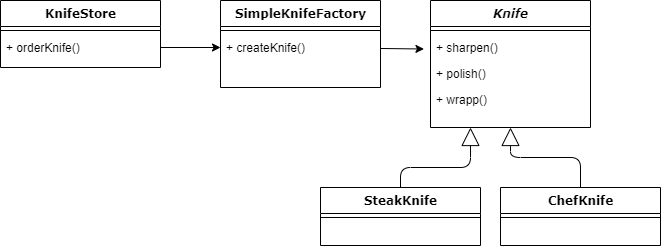

```{r setup, include=FALSE}
options(htmltools.dir.version = FALSE)
knitr::opts_chunk$set(collapse = TRUE,
                      fig.retina = 3)

# devtools::install_github("hadley/emo")
# devtools::install_github("rstudio/fontawesome")
library(emo)
library(fontawesome) # from github: https://github.com/rstudio/fontawesome

```

```{r, load_refs, include=FALSE, cache=FALSE}
source("load_references.r")
```

name: title
class: left, top
background-image: url(images/rawpixel/the-creation.jpg)
background-size: cover

# .fancy[`r rmarkdown::metadata$title`]

### &#183; `r rmarkdown::metadata$subtitle`

<br/><br/><br/><br/><br/><br/><br/><br/><br/><br/><br/>


.right[`r rmarkdown::metadata$author`&#183; `r rmarkdown::metadata$institute`]

.right[`r rmarkdown::metadata$description` &#183; `r rmarkdown::metadata$date`]


???


Michelangelo Buonarroti's The Creation of Adam (circa 1511) famous painting. Original public domain image from Wikimedia Commons.
Image credits: [Rawpixel.com](https://www.rawpixel.com/image/3848277)


---
class: center, top
background-image: url(images/rawpixel/cheese-factory.jpg)
background-size: cover

.large[Un objeto __Factory__ funciona como un fábrica del mundo real]

--

<br/><br/><br/>

# CREA PRODUCTOS 

--

# y los clientes no saben nada del proceso de CREACIÓN

???

Curing baby Swiss cheese rounds at the Alp and Dell factory. Original image from Carol M. Highsmith’s America, Library of Congress collection.
Image credits: [Rawpixel.com](https://www.rawpixel.com/image/433967)


---
class: right, bottom
background-image: url(images/rawpixel/knife.jpg)
background-size: cover

.large[Vas a diseñar una tienda online que vende tipos de cuchillos (_knifes_)...]

???

Close up of a kitchen knife
Image credits: [Rawpixel.com](https://www.rawpixel.com/image/432907)

---

.pull-left[
### Clase abstracta `Knife`

```{r engine='java'}
public abstract class Knife {
    String name;

    public void sharpen() {
        System.out.println("sharpen");
    }
    
    public void polish() {
        System.out.println("polish");
    }

    public void wrapp() {
        System.out.println("wrapp");
    }

    public String getName() {
        return name;
    }

}
```

]

--

.pull-right[
### Implementaciones de `Knife`

```{r engine='java'}
public class ChefKnife extends Knife {

    public ChefKnife() {
        name = "Chef knife";
    }
    
}
```

```{r engine='java'}
public class SteakKnife extends Knife {

    public SteakKnife() {
        name = "Steak knife";
    }
    
}
```


]

---

.pull-left[

```{r engine="java"}

public class KnifeStore() {
  
  public Knife orderKnife(String type) {
    Knife knife = null;

    if (type.equals("chef")) {  #<<
      knife = new ChefKnife();  #<<
    } else if (type.equals("steak")) {  #<<
      knife = new SteakKnife();  #<<
    }  #<<
      
    knife.sharpen();
    knife.polish();
    knife.wrapp();

    return knife;
  }
}
```
  
]

.pull-right[

### Clase `KnifeStore` 

.large[Produce `Knife`s de dos tipos ("productos")]

.large[Instanciación concreta con `new` (+ `if-else`)]
]

---

.pull-left[
  
```{r engine='java'}

public class KnifeStore() {
  
  public Knife orderKnife(String type) {
    Knife knife = null;

    if (type.equals("chef")) {  
      knife = new ChefKnife();  
    } else if (type.equals("steak")) {  
      knife = new SteakKnife();  
    } else if (type.equals("bread")) { #<<
      knife = new BreadKnife(); #<<
    } else if (type.equals("paring")) { #<<
      knife = new ParingKnife(); #<<
    } #<<
      
      
    knife.sharpen();
    knife.polish();
    knife.wrapp();

    return knife;
  }
}
```
  
]

.pull-right[

### Clase `KnifeStore` 

.large[La tienda `KnifeStore` crece y ofrece nuevos "productos"]

.large[Añadir o quitar tipos con cuchillos con `new + if-else` funciona...]

.large[...pero con 50 tipos de `Knife`... `r emo::ji("angry")`]


]

---
class: center, middle


# `r fontawesome::fa(name = "circle-exclamation")` [SOLID - Open/Close principle](https://cgranell.github.io/ei1039/slides/TE3_1_solid.html#ocp)

.large[`r fontawesome::fa(name = "yin-yang")` Las clases deben estar abiertas a la extensión pero __cerradas
a la modificación__]

--

.large[`r fontawesome::fa(name = "circle-exclamation")` `KnifeStore` no está cerrada a la modificación]


???

_Concrete instantiation_ crea problemas ya que cada nuevo subtipo de `Knife` implica modificar la clase base, violando el principio de "closed for modification". 


---
class: center, middle


# .coldinline[`r fontawesome::fa(name = "yin-yang")` [Encapsula lo que varía y sepáralo de lo que no cambia](https://cgranell.github.io/ei1039/slides/TE3_1_solid.html#principle-encapsulate)]

--

.large[Saca lo que varía (creación de objetos `Knife`) del método `orderKnife()` y encapsula ese código en un __Factory object (Simple Factory)__] 


---

.pull-left[

```{r engine="java"}

public class SimpleKnifeFactory() {
  
  public Knife createKnife(String type) {
    Knife knife = null;

    if (type.equals("chef")) {  #<<
      knife = new ChefKnife();  #<<
    } else if (type.equals("steak")) {  #<<
      knife = new SteakKnife();  #<<
    }  #<<
      
    return knife;
  }
}
```
  
]

.pull-right[

### Clase `SimpleKnifeFactory` 

.large[Gestiona los detalles de la creación de objetos]

.large[Encapsula lo que varía en `SimpleKnifeFactory`]

.large[Encapsula lo que no cambia en `KnifeStore`]

]


---

.pull-left[
  
```{r engine="java"}

public class KnifeStore() {

  private SimpleKnifeFactory factory; #<<
    
    public KnifeStore(SimpleKnifeFactory #<<
                      factory) {#<<
        this.factory = factory;#<<
    }#<<

    public Knife orderKnife(String type) {
        Knife knife = null;

        knife = factory.createKnife(type); #<<
      
        knife.sharpen();
        knife.polish();
        knife.wrapp();

        return knife;
    }  
}
```
  
]


.pull-right[

### Clase `KnifeStore`

.large[Necesitamos una referencia al objeto __Factory__]

.large[`orderKnife()` se convierte en  __cliente__ del Factory, y solo pide "productos" del tipo base `Knife`]

.large[`r fontawesome::fa(name = "circle-arrow-right")` Menos __acoplamiento__ entre clases]

]


---
class: left

# .center[Portavoces, atentos! ]

.pull-left[




]

.pull-right[

.large[`r fontawesome::fa(name = "circle-question")` ¿Quién es el cliente, la fábrica y el producto?]


.large[`r fontawesome::fa(name = "circle-question")` ¿En qué situaciones es ideal el `Factory object`?]


.large[`r fontawesome::fa(name = "circle-question")` ¿Qué beneficios aporta?]
]

???

Analogía: Un Apple Shop no produce iPhones, sino que los recibe de una Factory

Situación: Si muchos clientes instancian el mismo conjunto de clases ("productos"), es decir, los mismos objetos se requieren por otros componentes de un programa/aplicación.

Beneficio: Código más fácil de modificar

---
class: center, middle


# .coldinline[`r fontawesome::fa(name = "yin-yang")` [Programa a una interfaz*, no a una implementación](https://cgranell.github.io/ei1039/slides/TE3_1_solid.html#principle-interface)]

--

.large[El client `KnifeStore` no maneja clases concretas de `Knife` ("implementaciones"), sino la clase base `Knife` (una "generalización")] 


???

* "interfaz" se refiere tanto a una interfaz como clase abstracta

---
class: inverse, center, middle

# Patrón Factory Method

--

.large[Propósito]

.large[Problema]

.large[Solución]

.large[Estructura]

.large[Aplicabilidad]


---
name: purpose
class: center, middle

# Factory Method: Propósito

## proporciona una interfaz para crear familias de objetos relacionados o dependientes sin especificar sus clases concretas

---
name: problem
# Factory Method: Problema

.large[Ahora, `KnifeStore` no solo está en US, sino que se expande a Europa. Cada región tiene sus preferencias locales sobre los tipos de `Knife`]

.large[¿Especializamos `SimpleKnifeFactory` según la cultura local?]

- `USSimpleKnifeFactory` y 
- `EuropeSimpleKnifeFactory`

.large[Ok, la creación de objetos se especializa, pero el resto de funcionalidad como `orderKnife` resulta difícil de especializar]


---
name: solution
# Factory Method: Solución

- .large[En vez del objeto Factory `EuropeSimpleKnifeFactory`, el patrón Factory Method crea `EuropeKnifeStore` como subclase de `KnifeStore` (cliente).]

- .large[Cada subclase decide cómo se crean los objetos ("productos"), y sobreescriben el **método fábrica**]

- .large[Programa a una interfaz* para crear objetos]

---

.pull-left[
  
```{r engine="java"}

public abstract class KnifeStore() { #<<

  public Knife orderKnife(String type) {
    Knife knife = null;

    knife = createKnife(type); #<<
      
    knife.sharpen();
    knife.polish();
    knife.wrapp();

    return knife;
  }  
  
  abstract Knife createKnife(String type); #<<
}
```
  
]


.pull-right[

### Clase abstract `KnifeStore` 

.large[Clase base es abstracta]

.large[`createKnife()` es el Factory Method: abstracto y vacío]

]

---

.pull-left[
  
```{r engine="java"}

public class EuropeKnifeStore() 
       extends KnifeStore { 

  @override
  public Knife createKnife(String type) {
    if (type.equals("chef")) {
      return new EuropeChefKnife();  #<<
    } else if (type.equals("steak")) {
      return new EuropeSteakKnife(); #<<
    } else return null;
  }
}
```
  
]


.pull-right[

### Subclase `EuropeKnifeStore` 

.large[Implementa el Factory Method según los estándares europeos]

.large[Tale vez necesitas definir nuevos "productos" de la clase base `Knife`]

]

---
name: structure
# Factory Method: Estructura


.pull-left[


]

.pull-right[

.large[__Product__ (`Knife`) declara la interfaz común de objetos]

.large[__ConcreteProducts__ (`EuropeChefKnife`) son implementaciones de la interfaz]

]

???
Image credits: [refactoring.guru](https://refactoring.guru/es/design-patterns/factory-method)


---
# Factory Method: Estructura


.pull-left[


]

.pull-right[

.large[__Creator__ (`KnifeStore`) declara el factory method (*abstract*) que devuelve un objeto del mismo tipo que la interfaz __Product__]

.large[__ConcreteCreators__ (`EuropeKnifeStore`) sobreescriben el Factory Method de la superclase]
]

???
Image credits: [refactoring.guru](https://refactoring.guru/es/design-patterns/factory-method)

---
name: aplicability
# Factory Method: Aplicabilidad

.large[`r fontawesome::fa(name = "circle-arrow-right")` Cuando no sabes de antemano las dependencias y tipos exactos de los objetos de tu código] 

- .large[Factory Method separa el código de creación de "productos" del código que hace uso del producto]

--

.large[`r fontawesome::fa(name = "circle-arrow-right")` Cuando quieras ofrecer a los usuarios de tu código una forma de extender sus componentes internos] 

- .large[¡Me dicen que quieren abrir en Singapure! Ok, veámos:]
  - .large[Extiendo la clase base ``Knife` con los nuevos subtipos que necesito]
  - .large[Creo `SingapureKnifeStore` que sobreescribe el Factory Method para crear los nuevos productos]

