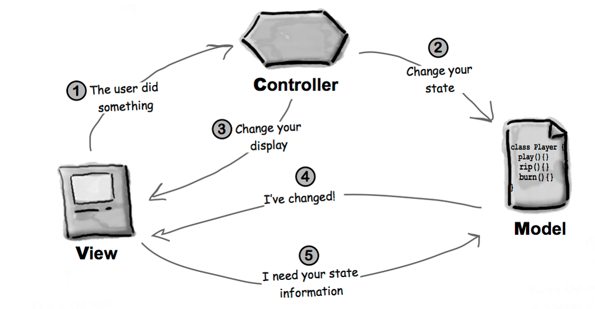
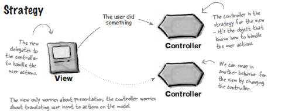
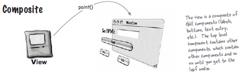
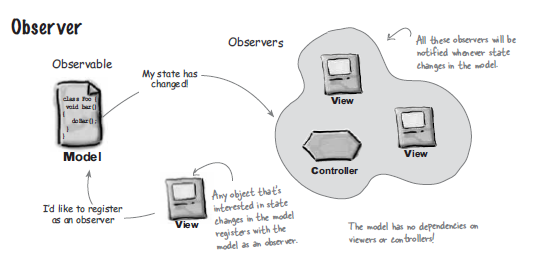

```{r setup, include=FALSE}
options(htmltools.dir.version = FALSE)
knitr::opts_chunk$set(collapse = TRUE,
                      fig.retina = 3)

# devtools::install_github("hadley/emo")
# devtools::install_github("rstudio/fontawesome")
library(emo)
library(fontawesome) # from github: https://github.com/rstudio/fontawesome

```

```{r, load_refs, include=FALSE, cache=FALSE}
source("load_references.r")
```

name: title
class: right, top
background-image: url(https://hackernoon.com/_next/image?url=https%3A%2F%2Fcdn.hackernoon.com%2Fhn-images%2F0*7LesGFlzQzpGiP8m&w=3840&q=75)
background-size: contain

# .fancy[`r rmarkdown::metadata$title`]

`r rmarkdown::metadata$author`&#183; `r rmarkdown::metadata$institute`

`r rmarkdown::metadata$description` &#183; `r rmarkdown::metadata$date`

???
Image credits: [hackernoon.com](https://hackernoon.com/from-mvc-to-modern-web-frameworks-8067ec9dee65)


---
class: inverse, center, middle

.acid[Model-View-Controller (MVC)]

--

.heat[Model-View-Presenter (MVP)]

--

.cold[Model-View-ViewModel (MVVM)]


---
# .acidinline[MVC] Inicios

.left-column[

```{r, fig.cap="Trygve Reenskaug", out.width = '100%', echo=FALSE}
knitr::include_graphics('https://upload.wikimedia.org/wikipedia/commons/7/77/Trygve_Reenskaug_%282010%29.jpg')
```

]

.right-column[

.large[`r fontawesome::fa(name = "arrow-circle-right")`  [Formulada](http://heim.ifi.uio.no/~trygver/themes/mvc/mvc-index.html) en 1978/79]

.large[`r fontawesome::fa(name = "arrow-circle-right")` Como un lenguaje compartido para describir problemas y sus soluciones ("Pattern Language")]

.large[`r fontawesome::fa(name = "arrow-circle-right")` Uso en la era pre-Web para GUI (Smalltalk, Mac OS, Window... ]
]


---
# .acidinline[MVC] Componentes 

### .acidinline[M]odel `r fontawesome::fa(name = "arrow-circle-right")` It includes all the data and its related logic

### .acidinline[V]iew `r fontawesome::fa(name = "arrow-circle-right")` Present data to the user or handles user interaction

### .acidinline[C]ontroller `r fontawesome::fa(name = "arrow-circle-right")` An interface between Model and View components


---
# .acidinline[MVC] Patrón de diseño o de arquitectura

.pull-left[

 ### .center[`r fontawesome::fa(name = "arrow-circle-right")` MVC como patrón de diseño si soluciona problemas específicos]
]

.pull-right[

### .center[`r fontawesome::fa(name = "arrow-circle-right")` MVC como patrón de arquitectura si afecta a toda (la arquitectura de) la aplicación]

]


---
# .acidinline[MVC] Como patrón de diseño 


```{r, fig.cap="MVC by Head First Design Patterns", out.width = '90%', echo=FALSE}

```

---
# .acidinline[MVC] Como patrón (compuesto) de diseño 

### .acidinline[V]iew-.acidinline[C]ontroller `r fontawesome::fa(name = "arrow-circle-right")` [`Strategy`](https://cgranell.github.io/ei1039/slides/TE7_2_strategy.html#title)

-   .large[La vista es un objeto configurado con una estrategia, el controlador] 

-   .large[La vista se encarga únicamente del aspecto visual y delega el resto al controlador, que se encarga de interactuar con el modelo] 

-   .large[La vista no conoce nada de la interacción entre el controlador y el modelo. Esta desacoplada] 


---
# .acidinline[MVC] Como patrón (compuesto) de diseño 

```{r, fig.cap="MVC-Strategy by Head First Design Patterns", out.width = '90%', echo=FALSE}

```

---
# .acidinline[MVC] Como patrón (compuesto) de diseño 

### .acidinline[V]iew `r fontawesome::fa(name = "arrow-circle-right")` [`Composite`](https://cgranell.github.io/ei1039/slides/TE5_1_composite.html#title)

-   .large[La vista consiste en un conjunto de ventanas, paneles, botones, etiquetas, etc.]

-   .large[Cada elemento visual es o bien un _Composite_ (un frame) o bien un _Leaf_ (un botón)]
] 


---
# .acidinline[MVC] Como patrón (compuesto) de diseño 

```{r, fig.cap="MVC-Composite by Head First Design Patterns", out.width = '90%', echo=FALSE}

```


---
# .acidinline[MVC] Como patrón (compuesto) de diseño 

### .acidinline[V]iew-.acidinline[M]odel `r fontawesome::fa(name = "arrow-circle-right")` [`Observer`](https://cgranell.github.io/ei1039/slides/TE6_1_observer.html#title)

-   .large[El modelo implementa el patrón `Observer`]

-   .large[La vista (y controlador) es un observador del modelo]

-   .large[El modelo está completamente desacoplado: no depende de la vista ni del controlador]

-   .large[Permite cambiar la vista sin afectar al modelo]


---
# .acidinline[MVC] Como patrón (compuesto) de diseño 

```{r, fig.cap="MVC-Observer by Head First Design Patterns", out.width = '90%', echo=FALSE}

```

---
# .acidinline[MVC] Beneficios 

-   .large[MVC architecture will separate the user interface from business logic and business logic]
-   .large[Components are reusable]
-   .large[Easy to maintain]
-   .large[Different components of the application in MVC can be independently deployed and maintained]
-   .large[This architecture help to test components independently]


---
# .acidinline[MVC] Como patrón de arquitectura


### Web MVC

### Web Frameworks


---
background-image: url(https://hackernoon.com/hn-images/0*1VVNmPlwpfeytDMh)
background-size: contain
# Web MVC

```{r, fig.cap="Web MVC", out.width = '80%', echo=FALSE, eval=FALSE}
knitr::include_graphics('https://hackernoon.com/hn-images/0*1VVNmPlwpfeytDMh')
```

???
Image credits: [hackernoon.com](https://hackernoon.com/from-mvc-to-modern-web-frameworks-8067ec9dee65)

---
# Web MVC

.pull-left[

```{r, fig.cap="Web MVC", out.width = '100%', echo=FALSE}
knitr::include_graphics('https://hackernoon.com/hn-images/0*1VVNmPlwpfeytDMh')
```


]

.pull-right[

.large[`r fontawesome::fa(name = "arrow-circle-right")` Controller gestiona la petición inicial, no la View]

.large[`r fontawesome::fa(name = "arrow-circle-right")` La View amasa HTML, JS y CSS en vez de presentr info y capturar entrada de datos]

.large[`r fontawesome::fa(name = "arrow-circle-right")` The HTML/JS would contain logic like button click handlers that would dispatch an action back to the controller via an XMLHttpRequest]
]

---
background-image: url(https://hackernoon.com/hn-images/0*dTPUy_vSyQPHe-kX)
background-size: contain
# Web Frameworks

```{r, fig.cap="Modern Web Frameworks", out.width = '65%', echo=FALSE, eval=FALSE}
knitr::include_graphics('https://hackernoon.com/hn-images/0*dTPUy_vSyQPHe-kX')
```

???
Image credits: [hackernoon.com](https://hackernoon.com/from-mvc-to-modern-web-frameworks-8067ec9dee65)


---
# Web Frameworks


.pull-left[

```{r, fig.cap="Modern Web Frameworks", out.width = '100%', echo=FALSE}
knitr::include_graphics('https://hackernoon.com/hn-images/0*dTPUy_vSyQPHe-kX')
```

]

.pull-right[

.large[`r fontawesome::fa(name = "arrow-circle-right")` ....]

.large[`r fontawesome::fa(name = "arrow-circle-right")` ....]


]

???
Image credits: [hackernoon.com](https://hackernoon.com/from-mvc-to-modern-web-frameworks-8067ec9dee65)


---
class: inverse, center, middle

.heat[Model-View-Presenter (MVP)]

--

.cold[Model-View-ViewModel (MVVM)]


---
# .heatinline[MVP] Model-View-.heatinline[Presenter]


---
class: inverse, center, middle

.cold[Model-View-ViewModel (MVVM)]


---
# .coldinline[MVVM] Model-View-.coldinline[ViewModel]


---
# MVC & Modern frameworks

???

https://hackernoon.com/from-mvc-to-modern-web-frameworks-8067ec9dee65

https://www.monocubed.com/10-most-popular-web-frameworks/


