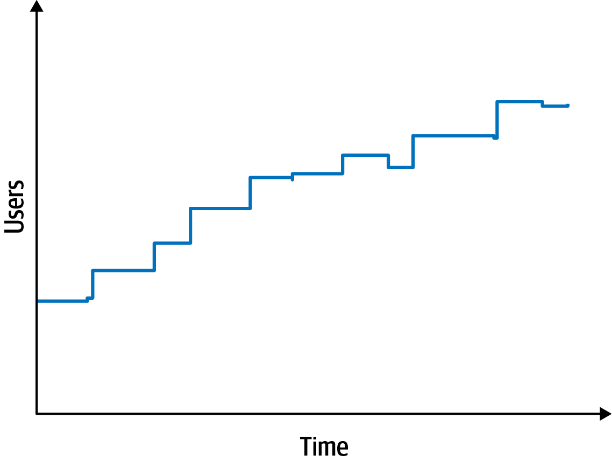
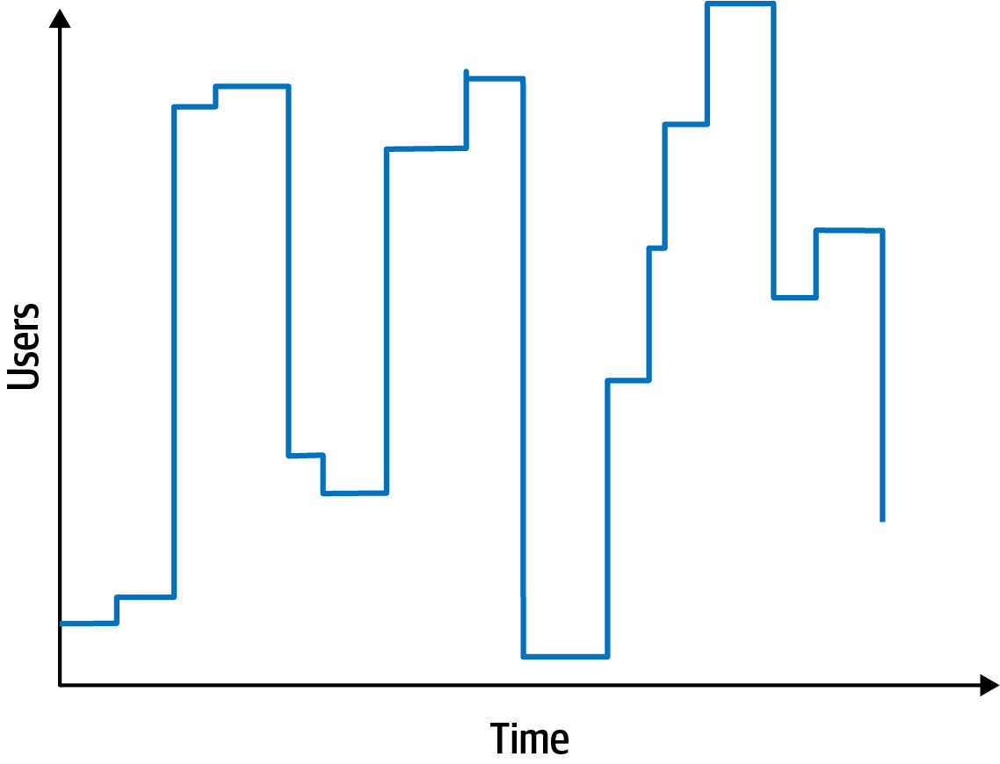

```{r setup, include=FALSE}
options(htmltools.dir.version = FALSE)
knitr::opts_chunk$set(collapse = TRUE,
                      fig.retina = 3)

library(fontawesome) # from github: https://github.com/rstudio/fontawesome

```

```{r, load_refs, include=FALSE, cache=FALSE}
source("load_references.r")
```

name: title
class: left, top
background-image: url(images/rawpixel/greenapartment.jpg)
background-size: cover

# .fancy[`r rmarkdown::metadata$title`]

### &#183; `r rmarkdown::metadata$subtitle`

<br/><br/><br/><br/><br/><br/><br/><br/><br/><br/><br/><br/><br/>


.whiteinline[`r rmarkdown::metadata$author`&#183; `r rmarkdown::metadata$institute`]

.whiteinline[`r rmarkdown::metadata$description` &#183; `r rmarkdown::metadata$date`]


???

Green apartment building. Original public domain image from Wikimedia Commons.
Image credits: [Rawpixel.com](https://www.rawpixel.com/image/3285587)


---
class: inverse, center, middle

# ¿Qué son las características de una arquitectura?

---
class: center, top
# Requisitos 

## _Todo lo que el software a desarrollar debe hacer_

--

.pull-left[

### Requisitos funcionales o de negocio
]

--

.pull-right[

### Requisitos no funcionales 

### .heatinline[`r fontawesome::fa(name = "circle-arrow-right")` características de la arquitectura]

]

--

.heat[Un arquitecto considera tanto los requisitos funcionales como las características de la arquitectura.]


---

.pull-left[


]

.pull-right[

### By Mark Richards, Neal Ford

### Released January 2020

.large[Capítulos 4 y 5 `r cite("richards2020")`]

]


---
background-image: url(images/SoftwareArchitecture02-Tai.png)
background-size: cover

???

Software Architecture “-ilities”: I probably won’t be able to see quality attributes by just looking at the high-level design diagram with some lines connecting to some boxes

Image credits: `r cite("tai2022")`


---
# .center[Características]

.left-column[
### Operacionales

]

.right-column[

- .large[Availability/Disponibilidad]: cuánto tiempo deberá estar disponible el sistema
- .large[Continuity/Continuidad]: capacidad de recuperación ante desastres
- .large[Performance/Rendimiento]: pruebas de estrés, análisis de picos, análisis de la frecuencia de las funciones utilizadas, capacidad requerida y tiempos de respuesta
- .large[Reliability/Fiabilidad]: Sistema a prueba de fallos
- .large[Robustness/Robustez]: Habilidad para manejar condiciones límite y de error (fallo hw)
- .large[Scalability/Escalabilidad]: Capacidad para gestionar un numero creciente de usuarios/solicitudes sin degradar rendimiento
- .large[Elasticity/Elasticidad]: Capacidad para gestionar picos masivos de usuarios/solicitudes
]

???

Continuity/continuidad = Recoverability/recuperabilidad

---
# .center[Características]

.left-column[
### Operacionales
### Estructurales
]

.right-column[

- .large[Configurability/Configurabilidad]: cambiar fácilmente aspectos de la configuración del software
- .large[Extensibility/Extensibilidad]: Importancia de añadir nuevas funcionalidades
- .large[Installability/Instalabilidad]: Facilidad de instalación del sistema en las plataformas necesarias.
- .large[Reuse/Reutilización]: Capacidad para aprovechar componentes comunes en múltiples productos
- .large[I18n]: Soporte para múltiples idiomas; unidades de medida; monedas

]


---
# .center[Características]

.left-column[
### Operacionales
### Estructurales
]

.right-column[

- .large[Maintainability/Mantenibilidad]: Facilidad de aplicar cambios y mejorar el sistema
- .large[Portability/Portabilidad]: ¿Es necesario que el sistema se ejecute en más de una plataforma?
- .large[Supportability/Soporte]: ¿Qué nivel de soporte técnico (logging) necesita la aplicación?
- .large[Upgradeability/Actualización]: Capacidad para actualizar rápidamente desde una versión anterior a una versión más nueva en servidores y clientes.

]


---
# .center[Características]

.left-column[
### Operacionales
### Estructurales
### Transversales
]

.right-column[

- .large[Accesibility/Accesibilidad]: Acceso a todos sus usuarios, incluidos aquellos con discapacidades como daltonismo o pérdida auditiva
- .large[Authentication/Autenticación]: Garantizar que los usuarios sean quienes dicen ser
- .large[Authorization/Autorización]: Garantizar que los usuarios solo puedan acceder a determinadas funciones.
- .large[Legal/Legalidad]: ¿A qué restricciones legislativas está sujeta el sistema (protección de datos, GDPR, etc.)?
- .large[Privacy/Privacidad]: Capacidad para ocultar transacciones/mensajes a los usuarios
- .large[Security/Seguridad]: ¿Es necesario cifrar los datos en la base de datos? ¿O en la comunicación entre sistemas/componentes internos?
- .large[Usability/Usabilidad]: Nivel de formación necesario para que los usuarios logren sus objetivos con el sistema.
]

---
class: inverse, center, middle


# ¡La mayoría de estas características no vienen _explícitamente_ escritas en los requisitos! 


---
class: inverse, center, middle

# ¿Cómo sé las que son relevantes de las que no lo son?


---
class: bottom, middle
background-image: url(images/rawpixel/tips.jpg)
background-size: cover


### #1 Selecciona las justas. 
###    No diseñes a _generic architecture_ 


???

Cada característica que añades complicará el diseño global del sistema. Mantén la lista corta!  

Helpful Tips Information Knowledge Concept.
Image credits: [Rawpixel.com](https://www.rawpixel.com/image/1033876)


---
class: bottom, middle
background-image: url(images/rawpixel/tips.jpg)
background-size: cover


### #2 Existen compromisos opuestos entre características. 
###    Todo es compromiso (_First Law of Software Architecture_) 

???

Por ejemplo, rendimiento vs seguridad. Aumentar la seguridad de un sistema, puede degradar su rendimiento. 

Helpful Tips Information Knowledge Concept.
Image credits: [Rawpixel.com](https://www.rawpixel.com/image/1033876)


---
class: bottom, middle
background-image: url(images/rawpixel/tips.jpg)
background-size: cover


### #3 Nunca busques la _mejor_ arquitectura, 
###    sino la _menos mala_. 

???

¿Sabes? la architectura, como el software, cambiará en el futuro. Diseña para que esos cambios sean fáciles en el futuro. 

Helpful Tips Information Knowledge Concept.
Image credits: [Rawpixel.com](https://www.rawpixel.com/image/1033876) 

---
class: inverse, center, middle

# Pero, ¿cómo extraigo las características relevantes? 

---
class: left, top
background-image: url(images/rawpixel/meeting.jpg)
background-size: cover


### Escucha a los _stakeholders_ 

### Entiende su lenguaje 

### Evita el problema _lost in translation_

### Traduce sus peticiones en características 

???

People meeting and brainstorming for a project.
Image credits: [Rawpixel.com](https://www.rawpixel.com/image/427255)

---
# .center[Si los stakeholders hablan de] 

.large[...adquisiciones y fusiones]

--

.right[.heat[Interoperability + scalability + adaptability + extensibility]]

--

.large[...reducir tiempos para llegar al mercado]

--

.right[.heat[Agility + testability + deployability]]


--

.large[...la satisfaccion del usuario]

--

.right[.heat[performance + availability + testability + security]]

--

.large[...presupuesto limitado]

--

.right[.heat[Simplicity + feasibility]]


---
class: center
# Warren Buffett's 25/5 Rule

### [Estrategia de productividad en 3 pasos](https://jamesclear.com/buffett-focus)

--

.large[Escribe los 25 objetivos para tu carrera/profesión]

--

.large[Marca las 5 más importantes]

--

.large[Descarta las otras 20. No requieren tu atención hasta que hayas tenido éxito con las top5] 

--

.heat[Deja que los stakeholders sean los que determinen las 3 (ó 5) características esenciales]

---
class: right, middle
background-image: url(images/sandra-sanchez-kata-tokio2020.jpg)
background-size: cover


# .whiteinline[Architectura _katas_]

???

[La final de kata femenina entre Sandra Sánchez y Kiyou Shimizu](https://www.sport.es/es/noticias/juegos-olimpicos/final-kata-femenina-sandra-sanchez-11969507)


---
# .center[Architectura katas]

.large[Para practicar la derivación de las características a partir de descripciones (de requisistos) explícitas]

- __Descripción__: El problema general del dominio que el sistema está tratando de resolver.

- __Usuarios__: El número esperado y/o tipos de usuarios del sistema.

- __Requisitos__: Lo que un arquitecto puede esperar de los stakeholders/expertos en el dominio

- __Contexto__: Otras consideraciones que no se expresan explícitamente en los requisitos, sino en el conocimiento implícito del dominio del problema.


???

See [Neal Ford's architectural katas](http://nealford.com/katas/list.html)

---
# Kata: Silicon Sandwiches

- __Descripción__: Una franquicia de tiendas de sándwiches nacional quiere habilitar los pedidos en línea (además de su actual servicio de llamada).

- __Usuarios__: Miles, quizás millones al día

- __Requisitos__

  - Los usuarios realizarán su pedido, luego se les dará un tiempo para recoger su sándwich e instrucciones para llegar a la tienda (que debe integrarse con varios servicios de mapas externos que incluyen información de tráfico).
  - Ofrece promociones diarias nacionales.
  - Ofrece promociones diarias locales.
  - Acepta pago en línea, en persona o a la entrega.

- __Contexto__:

  - La empresa matriz tiene planes a corto plazo para expandirse al extranjero.
  - El objetivo corporativo es contratar mano de obra barata para maximizar las ganancias.
  
???

Example from `r cite("richards2020")` on page 69

---
class: center
# Kata: Silicon Sandwiches

### Miles de usuarios, quizás millones al día

--

.pull-left[
### .heatinline[Escalabilidad]


]

--

.pull-right[
### .heatinline[Elasticidad]



]

???

Image credits: `r cite("richards2020")`

---
# Referencias

```{r print_refs1, echo=FALSE, results="asis"}
print(start = 1, end = 2)
```
