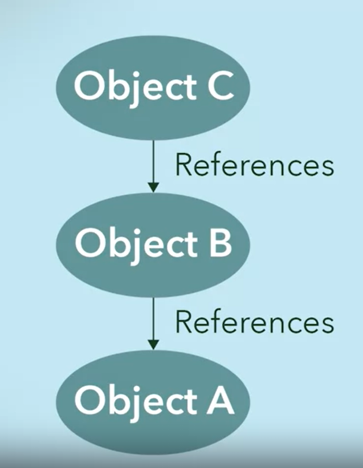

name: title
class: middle, center
background-image: url(images/rawpixel/brooklyn-bridge.jpg)
background-size: cover


```{r setup, include=FALSE}
options(htmltools.dir.version = FALSE)
knitr::opts_chunk$set(collapse = TRUE,
                      fig.retina = 3)

# devtools::install_github("hadley/emo")
# devtools::install_github("rstudio/fontawesome")
library(emo)
library(fontawesome) # from github: https://github.com/rstudio/fontawesome
```


```{r xaringan-extra, echo=FALSE}
library(xaringanExtra)

xaringanExtra:::use_xaringan_extra(c("tile_view", "panelset", "share_again", "editable"))

xaringanExtra::style_share_again(
  share_buttons = c("twitter", "linkedin", "pocket"))
xaringanExtra::use_scribble(
  pen_color = "#d33f49", pen_size = 4)
```


```{r, load_refs, include=FALSE, cache=FALSE}
source("load_references.r")
```


# .whiteinline[.fancy[`r rmarkdown::metadata$title`]]

### .whiteinline[&#183; `r rmarkdown::metadata$subtitle`]


.whiteinline[`r rmarkdown::metadata$author`&#183; `r rmarkdown::metadata$institute`]

.whiteinline[`r rmarkdown::metadata$description` &#183; `r rmarkdown::metadata$date`]


???

Brooklyn Bridge, New York City, United States. Original public domain image from Wikimedia Commons
Image credits: [Rawpixel.com](https://www.rawpixel.com/image/3282163)

---
class: inverse, center, middle
background-image: url(images/rawpixel/coffee.jpg)
background-size: contain


???
Podemos añadir otros ingredientes como leche, crema o chocolate a una taza de café. Los efectos de cada ingrediente no cambian la esencia del ingrediente base: el café siempre actuará como estimulante debido a su contenido de cafeína. Esto no cambia si agregamos leche, si cambiamos el estilo de preparación o si se sirve a diferentes temperaturas. El café seguirá siendo un estimulante.

Aerial view of various coffee.
Image credits: [Rawpixel.com](https://www.rawpixel.com/image/392580/)


---
class: inverse, center, middle

# Decorator Pattern

.large[Propósito]

.large[Problema]

.large[Solución]

.large[Estructura]

.large[Aplicabilidad]

---
name: purpose
class: center, middle

# Decorator: Propósito

## añade .coldinline[responsabilidades] (comportamientos) adicionales a un objeto .coldinline[dinámicamente]


---
name: problem
# Decorator: Problema

### Queremos ofrecer objetos con combinaciones flexibles de comportamientos

### El comportamiento de un objeto viene definido por su clase

### Herencia permite crear subclases con nuevos comportamientos, pero en tiempo de compilacion (estáticas)

### Muchas combinaciones de comportamientos derivan en muchas implementaciones de clases...  

---
name: solution

# Decorator: Solución

### Un _decorator_ añade comportamientos a un objeto dinámicamente (en tiempo de ejecución)

### Un _decorador_ utiliza agregación (HAS-A) en vez de herencia (IS-A) para combinar comportamientos

### Un _decorador_ permite que la funcionalidad de un objeto aumente "apilando" objetos decoradores (_aggregation stack_)

---
# Decorator: Aggregation stack

.left-column[



]

.right-column[

.large[`Object A` es el objeto base]

.large[`Object B` agrega (*decora*) `Object A`, augmentando el comportamiento del `Object A`]

.large[Cada objeto decorador en la pila se agrega en una relación **uno a uno** con el objeto debajo de él en la pila]

.large[Pila llamadas: C `r fontawesome::fa(name = "circle-arrow-right")` B `r fontawesome::fa(name = "circle-arrow-right")` A  comportamiento_C(comportamiento_B(comportamiento_A))]
]

???
La agregación "HAS-A" permite construir una pila de objetos donde cada nivel de la pila contiene un objeto que conoce su propio comportamiento y aumenta el que está debajo de él en la pila. 

---
name: structure
class: right, top
background-image: url(images/DivingDesingPatterns12.png)
background-size: contain

# Decorator: 
# Estructura


???
Image credits: [refactoring.guru](https://refactoring.guru/es/design-patterns/decorator)


---
# `r fontawesome::fa(name = "circle-question")` ¿Cualés son las razones para utilizar el patrón `Decorator`?

.large[`r fontawesome::fa(name = "a")` Permite construir una estructura de objetos en forma de árbol que puede tratarse como un tipo de objeto único y uniforme]


.large[`r fontawesome::fa(name = "b")` Oculta un objeto complejo que requiere muchos recursos hasta que sea necesario crearlo]


.large[`r fontawesome::fa(name = "c")` Reduce el número de clases necesarias para ofrecer una combinación de comportamientos]


.large[`r fontawesome::fa(name = "d")` Permite que los objetos agreguen dinámicamente comportamientos a otros objetos]

???
0011


---
# `r fontawesome::fa(name = "circle-question")` ¿Cómo funciona un patrón `Decorator`? Elige una

.large[`r fontawesome::fa(name = "a")` Construye un comportamiento apilando objetos]


.large[`r fontawesome::fa(name = "b")` Expande los métodos de una clase con herencia]


.large[`r fontawesome::fa(name = "c")` Encapsula una clase para darle una interfaz diferente]


.large[`r fontawesome::fa(name = "d")` Agrega características a una clase con una nueva clase]

???
1000


---
name: aplicability
# Decorator: Aplicabilidad

.large[`r fontawesome::fa(name = "circle-arrow-right")` Cuando necesitas asignar funcionalidades
adicionales a objetos durante el tiempo de ejecución sin descomponer el código cliente]

--

.large[`r fontawesome::fa(name = "circle-arrow-right")` Cuando no sea posible extender el comportamiento de un objeto utilizando la herencia]


---
name: aplicability
class: left, top
background-image: url(images/awarns-graphical-abstract.png)
background-size: contain
### [AwarNS Framework](https://github.com/GeoTecINIT/awarns-framework/)

---

# Decorator: Aplicabilidad

### [AwarNS Framework](https://github.com/GeoTecINIT/awarns-framework/)


.large[`r fontawesome::fa(name = "circle-arrow-right")` [Traceable-task](https://github.com/GeoTecINIT/awarns-framework/blob/main/packages/tracing/internal/tasks/traceable-task.ts) en paquete *tracing*, decora una tarea ([task](https://github.com/GeoTecINIT/nativescript-task-dispatcher/blob/master/src/internal/tasks/task.ts)) para hacer un seguimiento de su ejecución y resultado]


.large[`r fontawesome::fa(name = "circle-arrow-right")` [TimeSeriesSyncedStore](https://github.com/GeoTecINIT/awarns-framework/blob/main/packages/persistence/internal/stores/timeseries/synchronizer.ts) en paquete *persistence*, combina dos instancias y las expone con la misma interfaz, para sincronizar las operaciones de almacenamiento entre ellas]


---
# Resumen

### El patrón Decorator...

.large[`r fontawesome::fa(name = "circle-arrow-right")` agrega dinámicamente cualquier número de comportamientos a un objeto mediante el uso de la agregación como sustituto de la herencia]

.large[`r fontawesome::fa(name = "circle-arrow-right")` logra polimorfismo mediante la implementación de una única interfaz]
 
.large[`r fontawesome::fa(name = "circle-arrow-right")` crea una pila de objetos por agregación, en una relación uno a uno entre los objetos apilados]

.large[`r fontawesome::fa(name = "circle-arrow-right")` combina agregación y polimorfismo para invocar recursivamente el mismo comportamiento en la pila, ejecutándorse hacia arriba desde el objeto `Concrete Component`]

