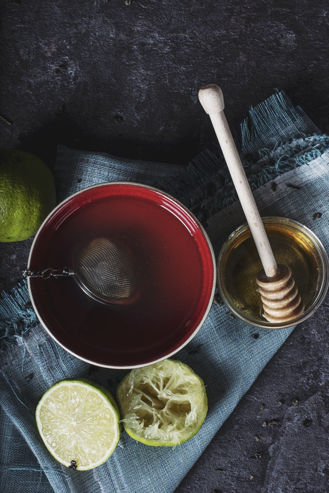
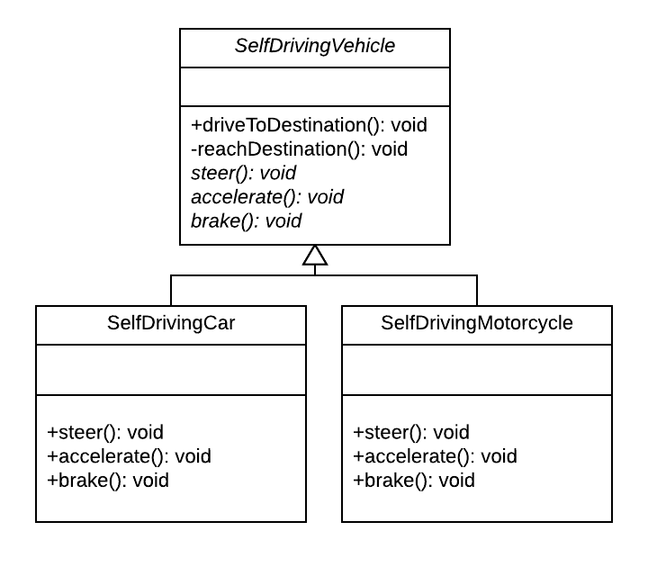
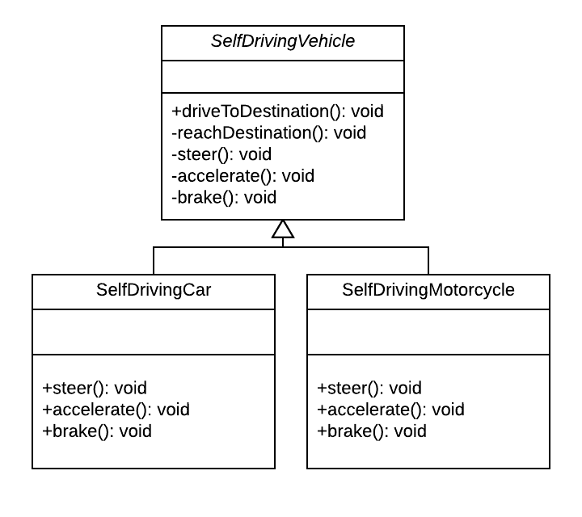

name: title
class: center, middle
background-image: url(images/rawpixel/jigsaw.jpg)
background-size: cover


```{r setup, include=FALSE}
options(htmltools.dir.version = FALSE)
knitr::opts_chunk$set(collapse = TRUE,
                      fig.retina = 3)

# devtools::install_github("hadley/emo")
# devtools::install_github("rstudio/fontawesome")
library(emo)
library(fontawesome) # from github: https://github.com/rstudio/fontawesome

```


```{r xaringan-extra, echo=FALSE, warning=FALSE}
library(xaringanExtra)

xaringanExtra:::use_xaringan_extra(c("tile_view", "panelset", "share_again", "editable"))

xaringanExtra::style_share_again(
  share_buttons = c("twitter", "linkedin", "pocket"))
xaringanExtra::use_scribble(
  pen_color = "#d33f49", pen_size = 4)
```


```{r, load_refs, include=FALSE, cache=FALSE}
source("load_references.r")
```

# .fancy[`r rmarkdown::metadata$title`]

### &#183; `r rmarkdown::metadata$subtitle`


`r rmarkdown::metadata$author`&#183; `r rmarkdown::metadata$institute`

`r rmarkdown::metadata$description` &#183; `r rmarkdown::metadata$date`


???

Jigsaw teamwork concept macro shot
Image credits: [Rawpixel.com](https://www.rawpixel.com/image/678830)

---
class: inverse, center, middle

.pull-left[


]

.pull-right[



]

???
Blue coffee cup.
Image credits: [Rawpixel.com](https://www.rawpixel.com/image/3283192)

Tea steeping in a red mug with lemons and honey on a blue towel and black table
Image credits: [Rawpixel.com](https://www.rawpixel.com/image/3283040)


Aunque café y té son bebidas distintas, ambas comparten muchas similitudes en su preparación. ¿No sería genial deshacerse de la duplicación de código, dejando intacta la estructura (serie de pasos) del algoritmo?

---
class: inverse, center, middle

# Template Method Pattern

.large[Propósito]

.large[Problema]

.large[Solución]

.large[Estructura]

.large[Aplicabilidad]

---
name: purpose
class: center, middle

# Template Method: Propósito

## define los .coldinline[pasos de un algoritmo] en la superclase y delega a las subclases la implementación de algunos de estos pasos .coldinline[de forma estática]


---
name: problem

# Template Method: Problema

### Dos (o más) objetos tienen uan secuencia de tareas similares (proceso/algortimo), pero su implementación es independiente (no reutilización)

### Si se implementan de forma totalmente separada, un cambio común a ambos objetos implica duplicación innecesaria (más mantenimiento, etc.)  


---
name: solution

# Template Method: Solución

### Permite cambiar el *comportamiento* de un algoritmo sin modificar su *estructura*

### Estructura: `AbstractClass` 

-   .large[Implementa el método plantilla (`final`) con los pasos de un algoritmo]
-   .large[Declara métodos abstractos que son pasos delegados a las subclases]
-   .large[Implementa métodos (primitivas) que son pasos comunes]
-   .large[Define ganchos (_hooks_) para pasos opcionales o extensiones del algoritmo]

---
name: solution

# Template Method: Solución


### Comportamiento: `ConcreteClass`

-   .large[Implementa los métodos abstractos de la superclase]
-   .large[Implementa los métodos gancho, si es necesario]


---
name: structure
class: left, top
background-image: url(images/DivingDesingPatterns17.png)
background-size: contain

# Estructura

???

- El método de plantilla es `final` para que las subclases no puedan cambiar el orden de los pasos.
- La clase base implementa todos los métodos que define pasos comunes para que las subclases no necesiten definirlos.
- La clase base crea métodos abstractos que deben implementar las subclases.

Image credits: [refactoring.guru](https://refactoring.guru/es/design-patterns/template-method)


---
class: right, top
background-image: url(images/HeadFirstDesingPatterns05.png)
background-size: contain

# `r cite("freeman2004")` 

???
Si tenemos una secuencia de pasos bien definida, *template method* es un buen candidato

---
background-image: url(images/HeadFirstDesingPatterns06.png)
background-size: contain

???

Diferenciamos los pasos comunes de los que requieren especialización por receta (algoritmo) concreta

`r cite("freeman2004")` 

---
background-image: url(images/HeadFirstDesingPatterns07.png)
background-size: contain

???

Aun podemos generalizar más los pasos del algoritmo: `brew()` y `addCondiments` hacen practicamente lo mismo, aunque difieren en la implementación. Los hacemos `abstract` en la clase base para que las subclases los implementen.

`r cite("freeman2004")` 

---
background-image: url(images/HeadFirstDesingPatterns08.png)
background-size: contain

???

Implementación concreta de los métodos abstractos de la superclase.

`r cite("freeman2004")` 

---
background-image: url(images/HeadFirstDesingPatterns09.png)
background-size: contain

???

Esquema final de la superclase abstracta.

`r cite("freeman2004")` 


---
class: right, middle
background-image: url(images/HeadFirstDesingPatterns10.png)
background-size: contain

# Hooks?

???

Un gancho o _hook_ es un método declarado en la clase abstracta, pero sin implementación o una por defecto. Las subclases pueden o no implementarlo. En cualquier caso, los hooks permiten extender el algoritmo en puntos bien definidos

`r cite("freeman2004")` 

---
# Ejemplos reales

### Común en aplicaciones derivadas de frameworks

- .large[__Servlets en Java__: la clase [HttpServlet](https://github.com/eclipse-ee4j/servlet-api/blob/master/api/src/main/java/jakarta/servlet/http/HttpServlet.java) tiene el método [service](https://github.com/eclipse-ee4j/servlet-api/blob/fc3f85f80c7a2e439a99d5bd5647a8161dd1b93c/api/src/main/java/jakarta/servlet/http/HttpServlet.java#L519), que actúa como un `Template Method`, y delega en el método `doXXX()` apropiado, por ejemplo [doGet()](https://github.com/eclipse-ee4j/servlet-api/blob/fc3f85f80c7a2e439a99d5bd5647a8161dd1b93c/api/src/main/java/jakarta/servlet/http/HttpServlet.java#L162), los cuales pueden ser sobreescritos por una implementación concreta del `servlet`]

- .large[__TestCases en JUnit__: la clase [TestCase](https://github.com/junit-team/junit4/blob/main/src/main/java/junit/framework/TestCase.java) del framework JUnit tiene el método [runBare()](https://github.com/junit-team/junit4/blob/7167b23b3ba7dd79410f6e9db350d16cbe30617b/src/main/java/junit/framework/TestCase.java#L138) que actúa como un `Template Method`, y llama a los métodos [setup()](https://github.com/junit-team/junit4/blob/7167b23b3ba7dd79410f6e9db350d16cbe30617b/src/main/java/junit/framework/TestCase.java#L474) y [teardown()](), que son _hooks_ que los test cases concretos puede implementar]

---
name: aplicability

# Template Method: Aplicabilidad

.large[`r fontawesome::fa(name = "circle-arrow-right")` cuando tenemos algoritmos muy similares]

--

.large[`r fontawesome::fa(name = "circle-arrow-right")` cuando tenemos algoritmos con secuencias de pasos predefinidas muy similares]

--

.large[`r fontawesome::fa(name = "circle-arrow-right")` cuando queremos evitar duplicación de código y trasladamos la implementación de los pasos comunes a la clase base]


---
# `r fontawesome::fa(name = "circle-question")` Elige el diagrama UML correcto según lo descrito abajo

> .large[El nombre de un método de plantilla para una clase de vehículos autónomos podría ser conducir hasta el destino (`drivetoDestination()`. Tanto un automóvil autónomo como una motocicleta requieren  de una función para llegar a su destino (`reachDestination()`)]

???

El nombre de un método de plantilla para la clase "vehículos autónomos" podría ser conducir hasta el destino (`drivetoDestination()`). Tanto un automóvil autónomo como una motocicleta (subclases) requieren de una función para llegar a su destino (`reachDestination()`)


---

.pull-left[

.large[`r fontawesome::fa(name = "a")`]



]

.pull-right[

.large[`r fontawesome::fa(name = "b")`]


]


---

.pull-left[


.large[`r fontawesome::fa(name = "c")`] 



]


.pull-right[

.large[`r fontawesome::fa(name = "d")`]


]


---
name: summary
# Resumen

### El patrón Method Template...

.large[`r fontawesome::fa(name = "circle-arrow-right")` encapsula (generaliza) los pasos de un algoritmo en una clase `abstract` mediante un método plantilla]

.large[`r fontawesome::fa(name = "circle-arrow-right")` diferencia  entre los pasos comunes y los que necesitan especialización]
 
.large[`r fontawesome::fa(name = "circle-arrow-right")` cambia partes de un algoritmo (estáticamente) mediante herencia y sobrecarga de métodos (_overriding_)]


---
# Referencias

```{r print_refs1, echo=FALSE, results="asis"}
print(start = 1, end = 1)
```

