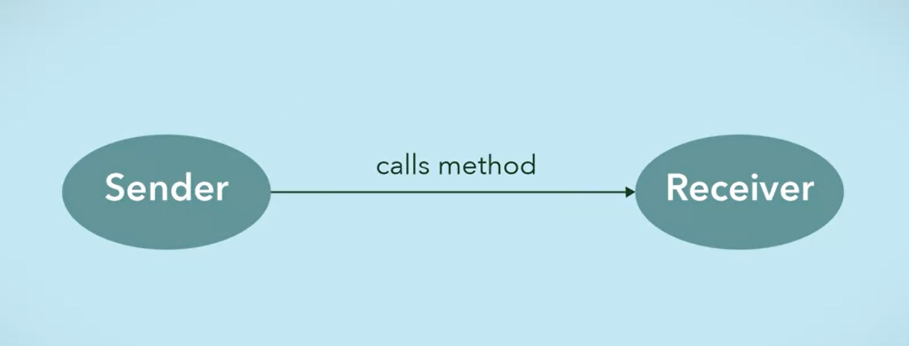
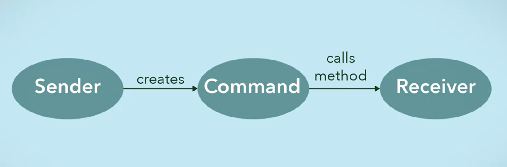

```{r setup, include=FALSE}
options(htmltools.dir.version = FALSE)
knitr::opts_chunk$set(collapse = TRUE,
                      fig.retina = 3)

# devtools::install_github("hadley/emo")
# devtools::install_github("rstudio/fontawesome")
library(emo)
library(fontawesome) # from github: https://github.com/rstudio/fontawesome

```

```{r, load_refs, include=FALSE, cache=FALSE}
source("load_references.r")
```

name: title
class: center, middle
background-image: url(images/rawpixel/jigsaw.jpg)
background-size: cover

# .fancy[`r rmarkdown::metadata$title`]

### &#183; `r rmarkdown::metadata$subtitle`


`r rmarkdown::metadata$author`&#183; `r rmarkdown::metadata$institute`

`r rmarkdown::metadata$description` &#183; `r rmarkdown::metadata$date`


???

Jigsaw teamwork concept macro shot
Image credits: [Rawpixel.com](https://www.rawpixel.com/image/678830)

---
class: inverse, center, middle
background-image: url(images/sticky-notes-refrigerator.jpg)
background-size: cover


???
El mando del tv

Image credits: [dreamstime.com](https://www.dreamstime.com/photos-images/sticky-notes-refrigerator.html)


---
class: inverse, center, middle

# Command Pattern

.large[Propósito]

.large[Problema]

.large[Solución]

.large[Estructura]

.large[Aplicabilidad]

---
class: center, middle

# Command: Propósito

## encapsula una .coldinline[petición] a un objeto .coldinline[como un objeto] en sí mismo


---
# Command: Problema



---
# Command: Problema

### Almacenar o planificar distintas peticiones a objetos

### Hacer o deshacer operaciones/acciones


---
# Command: Problema




---
# Command: Solución

### `Invoker`

-   .large[Pide llevar a cabo una (o muchas) operación/accion como una petición al `Command`]

### `Receiver`

-   .large[Implementa la operación/acción deseada]

---
# Command: Solución

### `Command`

-   .large[Declara una interfaz para ejecutar una operación]


### `ConcreteCommand`

-   .large[Implementa la operación delegando al método correspondiente a uno (o muchos) `Receiver`]


---
class: left, bottom
background-image: url(images/DivingDesingPatterns19.png)
background-size: contain

# Estructura

???

Image credits: [refactoring.guru](https://refactoring.guru/es/design-patterns/command)

---
class: right, top
background-image: url(images/HeadFirstDesingPatterns11.png)
background-size: contain

# `r Cite(my_refs, "freeman2004")` 

???

---
background-image: url(images/HeadFirstDesingPatterns12.png)
background-size: contain

???

`r Cite(my_refs, "freeman2004")` 

---
background-image: url(images/HeadFirstDesingPatterns13.png)
background-size: contain

???

`r Cite(my_refs, "freeman2004")` 


---
# Ejemplos reales

-   .large[trabajos/operaciones en cola]

-   .large[transacciones de operaciones: o todas se completan o ninguna]

-   .large[serialización de objetos, i.e, guardar descripción de un objeto en un fichero]

-   .large[hacer o deshcer una operación, como el comando "Deshacer" de un editor de texto o al borrar un mensaje de correo en Gmail] 

---
# Command: Aplicabilidad

.large[`r fontawesome::fa(name = "arrow-circle-right")` cuando queremos parametrizar objetos con operaciones para pasar comandos como argumentos de un método, almacenar comandos en otros objetos, etc.]

--

.large[`r fontawesome::fa(name = "arrow-circle-right")` cuando queremos planificar, poner en cola o serializar operaciones]

--

.large[`r fontawesome::fa(name = "arrow-circle-right")` cuando queremos implementar operaciones reversibles]


---
# Resumen

### El patrón Command...

.large[`r fontawesome::fa(name = "arrow-circle-right")` encapsula una llamada a un método como un objeto]

.large[`r fontawesome::fa(name = "arrow-circle-right")` desacopla el objeto que invoca del que realiza la acción]

---
# Referencias

```{r print_refs1, echo=FALSE, results="asis"}
PrintBibliography(my_refs, start = 1, end = 1)
```


